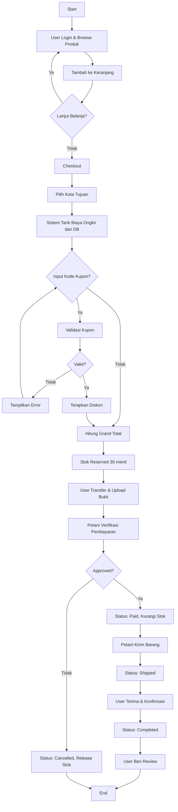
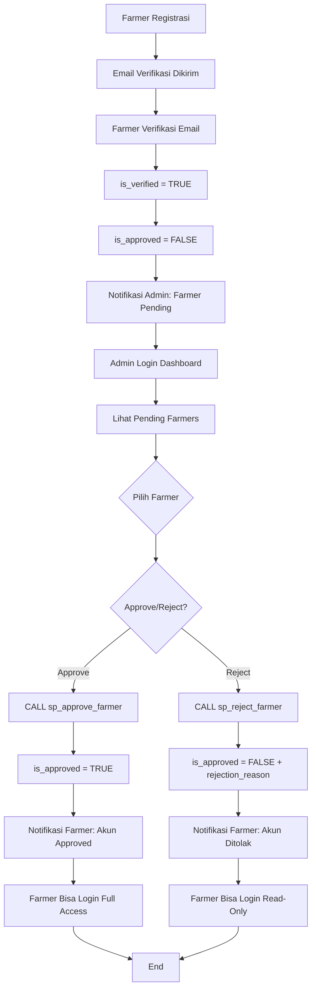
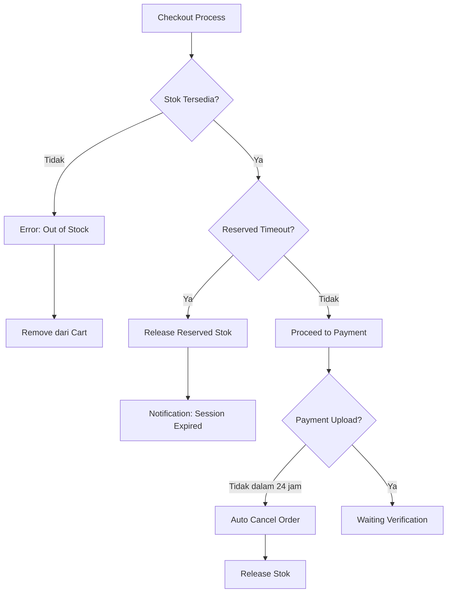
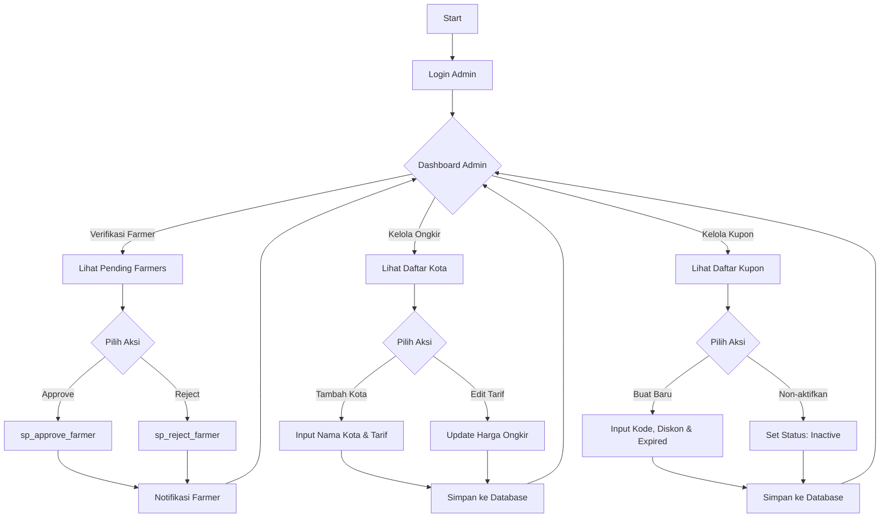
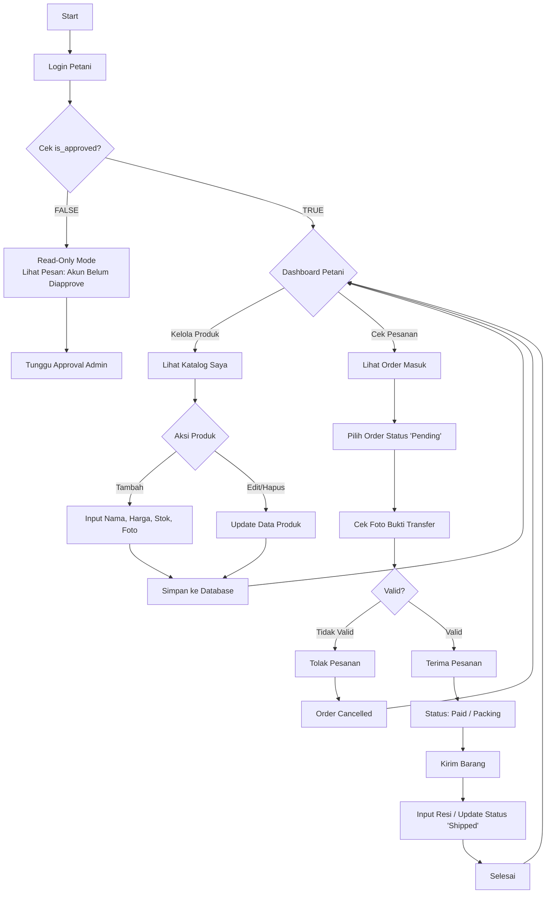

# Smart Urban Farming Marketplace - System Design Document

## 1. Kelompok dan Tema Project

**Nama Project:** Smart Urban Farming Marketplace  
**Tema:** Platform E-commerce untuk Produk Pertanian Urban  
**Mata Kuliah:** SMBDL & Pemrograman Web Lanjut  

> **Catatan:** Project ini disinkronkan dengan tugas Pemrograman Web Lanjut untuk implementasi sistem end-to-end.

---

## 2. Abstraksi Sistem Informasi

### Deskripsi Sistem
Smart Urban Farming Marketplace adalah platform jual-beli produk pertanian urban yang menghubungkan petani lokal dengan konsumen. Sistem ini dirancang untuk menangani transaksi semi-otomatis dimana sistem mampu menghitung total belanjaan secara cerdas (Harga Produk + Ongkir Spesifik Kota - Diskon Kupon), namun pembayaran tetap divalidasi secara manual melalui upload bukti transfer untuk kemudahan implementasi.

### Ruang Lingkup Proses
1. **Manajemen Katalog (Petani):** Pengelolaan data produk sayur/buah dengan status stok *ready*.
2. **Manajemen Wilayah & Tarif (Admin):** Pengaturan database kota tujuan pengiriman beserta tarif ongkos kirim tetap (*flat rate*) per kota.
3. **Manajemen Promosi (Admin):** Pembuatan kode voucher/kupon diskon dengan batasan waktu (*expired date*), usage limit, dan minimal pembelian.
4. **Keranjang & Checkout:** Sistem kalkulasi total bayar yang dinamis dengan mekanisme reserved stock (timeout 30 menit).
5. **Verifikasi Pesanan:** Validasi pembayaran manual (cek mutasi & bukti foto) oleh petani/admin.
6. **Ulasan Produk:** Pembeli dapat memberikan rating dan komentar setelah transaksi selesai.
7. **Notifikasi:** Sistem mengirim notifikasi email otomatis saat status order berubah.
8. **Verifikasi Akun Farmer:** Admin approve/reject akun farmer baru.

### Tujuan Sistem
* **Bagi Petani:** Memperluas pasar dengan sistem pencatatan pesanan yang rapi dan transparan.
* **Bagi Pembeli:** Mendapatkan transparansi biaya kirim dan keuntungan dari promo/diskon.
* **Bagi Pengembang:** Mengimplementasikan relasi database majemuk (*One-to-Many*, *Many-to-Many*) dan logika bisnis transaksional yang kompleks.

---

## 3. Identifikasi Pengguna dan Kebutuhannya

### A. Pembeli (Customer)
**Kebutuhan Fungsional:**
* Registrasi akun dengan verifikasi email
* Melihat katalog produk berdasarkan kategori dan pencarian
* Menambahkan produk ke keranjang belanja (*Cart*) dengan stok reserved
* Memilih kota pengiriman saat checkout agar biaya ongkir muncul otomatis
* Memasukkan kode kupon (jika ada) dengan validasi realtime
* Mengunggah bukti pembayaran (format: JPG/PNG, max 2MB)
* Melacak status pesanan (Pending → Awaiting Payment → Paid → Shipped → Completed)
* Membatalkan pesanan sebelum pembayaran diverifikasi
* Memberikan ulasan (*Review*) pada item produk yang telah dibeli
* Menerima notifikasi email saat status order berubah

**Kebutuhan Non-Fungsional:**
* Password terenkripsi (bcrypt/hash)
* Session timeout 2 jam

### B. Petani (Seller) - **Status: Approved Farmer**
**Kebutuhan Fungsional:**
* CRUD data produk milik sendiri (tidak bisa edit produk petani lain)
* Upload gambar produk (max 5MB, format JPG/PNG)
* Melihat daftar pesanan masuk (*Incoming Orders*) yang sudah dibayar
* Memverifikasi/menolak bukti transfer pembeli dengan alasan penolakan
* Mengupdate status pesanan menjadi "Dikirim" dengan input nomor resi
* Melihat dan merespons ulasan dari pembeli
* Mengelola informasi rekening bank untuk menerima pembayaran
* Dashboard analitik: total penjualan, produk terlaris, rating rata-rata

**Kebutuhan Non-Fungsional:**
* Role-based access control (RBAC)
* Audit log untuk perubahan data produk

### C. Admin (Platform Owner)
**Kebutuhan Fungsional:**
* **Verifikasi Akun Petani Baru** - Approve/Reject dengan reason
* **Daftar Pending Farmers** - Lihat farmer menunggu approval dengan prioritas
* Mengelola Data Kota & Tarif Ongkir (CRUD Master Data)
* Mengelola Data Kupon Diskon (Kode, Jumlah/Persentase Potongan, Masa Berlaku, Usage Limit, Min Purchase)
* Monitoring semua transaksi di platform
* Broadcast notifikasi promo ke semua user
* Dashboard platform: total GMV, jumlah transaksi, user aktif, **statistik approval farmer**

---

## 4. Desain Sistem Informasi

### A. Alur Proses (Activity Diagram)

#### **Alur Transaksi Utama (Happy Path)**


#### **Alur Verifikasi Akun Farmer (BARU)**


#### **Alur Exception Handling**


### **Alur Admin (Updated)**


### **Alur Seller (Petani) - Updated dengan Approval Check**


### B. Rule Bisnis (Updated)

#### **7. Logika Verifikasi Akun Farmer (BARU)**
1. **Registrasi Farmer**: `is_verified = FALSE`, `is_approved = FALSE`
2. **Email Verification**: `is_verified = TRUE`, `is_approved = FALSE` (pending)
3. **Pending State**: Farmer bisa login tapi **read-only** (tidak bisa CRUD produk/order)
4. **Admin Approval**: 
   - `is_approved = TRUE`, `approved_by = admin_id`, `approved_at = NOW()`
   - Notifikasi email ke farmer
5. **Admin Rejection**: 
   - `is_approved = FALSE`, `rejection_reason = "Alasan penolakan"`
   - Notifikasi email ke farmer
6. **Access Control**: 
   ```sql
   fn_can_manage_products(user_id) = (role='admin') OR (role='farmer' AND is_approved=TRUE)
   ```

### C. Rancangan Database (Updated)

#### **Tabel Users - Updated dengan Approval Fields**
```sql
CREATE TABLE users (
    id INT PRIMARY KEY AUTO_INCREMENT,
    role_id INT NOT NULL,
    name VARCHAR(100) NOT NULL,
    email VARCHAR(100) UNIQUE NOT NULL,
    password VARCHAR(255) NOT NULL COMMENT 'Hashed with bcrypt',
    address TEXT,
    phone VARCHAR(20),
    is_verified BOOLEAN DEFAULT FALSE COMMENT 'Email verified',
    is_approved BOOLEAN DEFAULT FALSE COMMENT 'Admin approved (for farmers)',
    approved_by INT NULL COMMENT 'FK to admin who approved',
    approved_at TIMESTAMP NULL,
    rejection_reason TEXT NULL COMMENT 'Reason if rejected',
    created_at TIMESTAMP DEFAULT CURRENT_TIMESTAMP,
    updated_at TIMESTAMP DEFAULT CURRENT_TIMESTAMP ON UPDATE CURRENT_TIMESTAMP,

    FOREIGN KEY (role_id) REFERENCES roles(id) ON DELETE RESTRICT,
    FOREIGN KEY (approved_by) REFERENCES users(id) ON DELETE SET NULL,
    INDEX idx_email (email),
    INDEX idx_role (role_id),
    INDEX idx_verified (is_verified),
    INDEX idx_approved (is_approved),
    INDEX idx_role_approved (role_id, is_approved)
);
```

#### **Tabel Approval History (BARU)**
```sql
CREATE TABLE approval_history (
    id INT PRIMARY KEY AUTO_INCREMENT,
    user_id INT NOT NULL,
    old_status BOOLEAN,
    new_status BOOLEAN,
    changed_by INT NULL,
    changed_at TIMESTAMP DEFAULT CURRENT_TIMESTAMP,
    reason TEXT,

    FOREIGN KEY (user_id) REFERENCES users(id) ON DELETE CASCADE,
    FOREIGN KEY (changed_by) REFERENCES users(id) ON DELETE SET NULL,
    INDEX idx_user (user_id),
    INDEX idx_changed_at (changed_at)
);
```

#### **View: Pending Farmers (BARU)**
```sql
CREATE VIEW vw_pending_farmers AS
SELECT 
    u.id,
    u.name,
    u.email,
    u.phone,
    u.address,
    u.created_at,
    DATEDIFF(NOW(), u.created_at) as days_waiting,
    CASE 
        WHEN DATEDIFF(NOW(), u.created_at) > 3 THEN 'URGENT'
        WHEN DATEDIFF(NOW(), u.created_at) > 1 THEN 'MODERATE'
        ELSE 'NORMAL'
    END as priority
FROM users u
INNER JOIN roles r ON u.role_id = r.id
WHERE r.name = 'farmer'
  AND u.is_verified = TRUE
  AND u.is_approved = FALSE
ORDER BY u.created_at ASC;
```

### D. Stored Procedures untuk Approval (BARU)

#### **SP: Approve Farmer**
```sql
DELIMITER $$
CREATE PROCEDURE sp_approve_farmer(
    IN p_farmer_id INT,
    IN p_admin_id INT
)
BEGIN
    DECLARE v_role_name VARCHAR(50);

    -- Validasi farmer
    SELECT r.name INTO v_role_name
    FROM users u INNER JOIN roles r ON u.role_id = r.id
    WHERE u.id = p_farmer_id;

    IF v_role_name != 'farmer' THEN
        SIGNAL SQLSTATE '45000' SET MESSAGE_TEXT = 'Bukan farmer account';
    END IF;

    -- Update approval
    UPDATE users SET
        is_approved = TRUE,
        approved_by = p_admin_id,
        approved_at = NOW(),
        rejection_reason = NULL
    WHERE id = p_farmer_id;

    SELECT 'Approved' as status;
END$$
DELIMITER ;
```

#### **SP: Reject Farmer**
```sql
DELIMITER $$
CREATE PROCEDURE sp_reject_farmer(
    IN p_farmer_id INT,
    IN p_admin_id INT,
    IN p_reason TEXT
)
BEGIN
    UPDATE users SET
        is_approved = FALSE,
        approved_by = NULL,
        approved_at = NULL,
        rejection_reason = p_reason
    WHERE id = p_farmer_id;

    SELECT CONCAT('Rejected: ', p_reason) as status;
END$$
DELIMITER ;
```

#### **Function: Can Manage Products**
```sql
DELIMITER $$
CREATE FUNCTION fn_can_manage_products(p_user_id INT)
RETURNS BOOLEAN
READS SQL DATA
DETERMINISTIC
BEGIN
    DECLARE v_role VARCHAR(50);
    DECLARE v_approved BOOLEAN;

    SELECT r.name, u.is_approved INTO v_role, v_approved
    FROM users u INNER JOIN roles r ON u.role_id = r.id
    WHERE u.id = p_user_id;

    IF v_role = 'admin' THEN RETURN TRUE; END IF;
    IF v_role = 'farmer' AND v_approved = TRUE THEN RETURN TRUE; END IF;
    RETURN FALSE;
END$$
DELIMITER ;
```

### E. Query Examples untuk Approval (BARU)

#### **1. Lihat Pending Farmers**
```sql
SELECT * FROM vw_pending_farmers ORDER BY days_waiting DESC;
```

#### **2. Approve Farmer**
```sql
CALL sp_approve_farmer(10, 1);  -- farmer_id=10, admin_id=1
```

#### **3. Reject Farmer**
```sql
CALL sp_reject_farmer(11, 1, 'Data tidak lengkap: alamat tidak valid');
```

#### **4. Cek Permission CRUD Produk**
```sql
SELECT fn_can_manage_products(10) as can_crud;  -- 1=TRUE, 0=FALSE
```

#### **5. Statistik Approval Admin Dashboard**
```sql
SELECT 
    r.display_name as role,
    COUNT(u.id) as total_users,
    SUM(CASE WHEN u.is_approved = TRUE THEN 1 ELSE 0 END) as approved_count,
    COUNT(CASE WHEN u.is_approved = FALSE AND u.is_verified = TRUE THEN 1 END) as pending_count
FROM roles r
LEFT JOIN users u ON r.id = u.role_id
GROUP BY r.id, r.display_name;
```

---

## 5. Non-Functional Requirements (Updated)

### **Keamanan (Security)**
- **Approval validation**: Hanya admin bisa approve/reject farmer
- Role validation menggunakan JOIN ke tabel `roles` dengan indexed queries
- **Farmer read-only mode** jika `is_approved = FALSE`

---

## 6. Diskusi & Konsultasi FP (Updated)

### **Pertanyaan Tambahan:**
8. **Approval System**: Apakah farmer pending bisa login read-only, atau diblokir total sampai approved?

### **Timeline Estimasi (Updated):**
| Week | Task | Deliverable |
|:---:|:---|:---|
| 1-2 | **Database + Approval system**, Authentication with Roles | ERD + Farmer approval flow implemented |
| 3 | Product catalog CRUD **with approval check** | **Approved farmers** can manage products only |

---

## Changelog

**Version 1.3** (2025-12-16) **COMPLETE FARMER APPROVAL SYSTEM**
- ✅ **MAJOR:** Ditambahkan **Alur Verifikasi Akun Farmer** lengkap
- ✅ **NEW:** Activity Diagram "Alur Verifikasi Farmer" (Mermaid)
- ✅ Updated: Alur Admin & Seller dengan approval logic
- ✅ **NEW:** Kolom `is_approved`, `approved_by`, `approved_at`, `rejection_reason`
- ✅ **NEW:** Tabel `approval_history` + `vw_pending_farmers`
- ✅ **NEW:** 2 Stored Procedures: `sp_approve_farmer`, `sp_reject_farmer`
- ✅ **NEW:** Function `fn_can_manage_products` untuk RBAC
- ✅ **NEW:** 10+ Query examples untuk approval workflow
- ✅ Updated: Rule Bisnis #7 untuk farmer verification
- ✅ Updated: Timeline Week 1-2 include approval system

**Total Entitas:** **13 tabel** (tambah `approval_history`)  
**Total Diagrams:** 5 (tambah verifikasi farmer)  
**Total Stored Procedures:** 2  
**Approval System:** ✅ **Production Ready**
