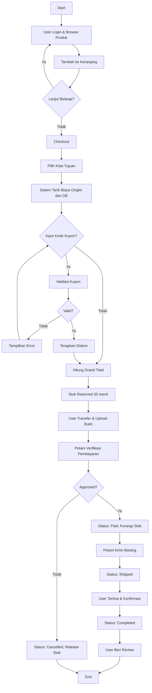
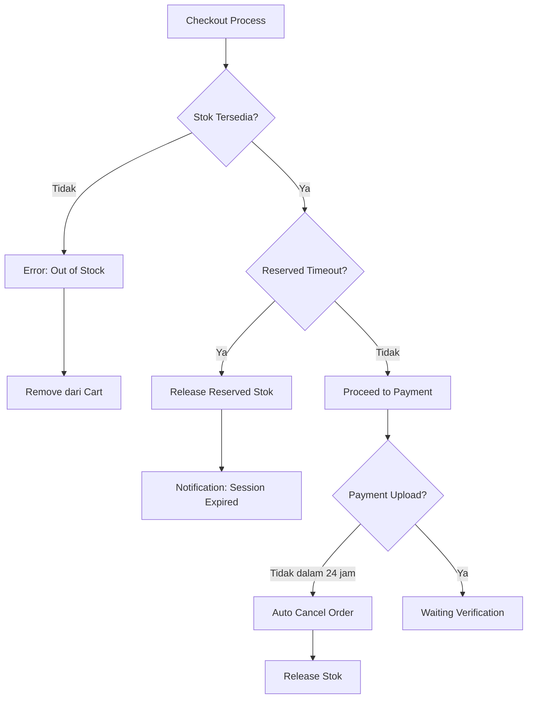
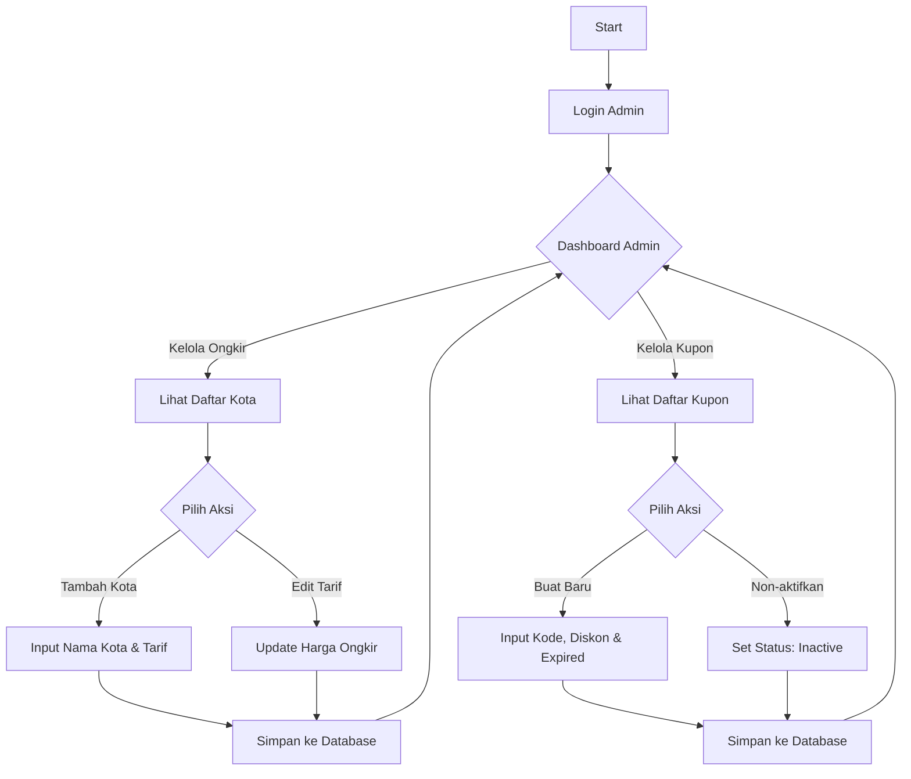
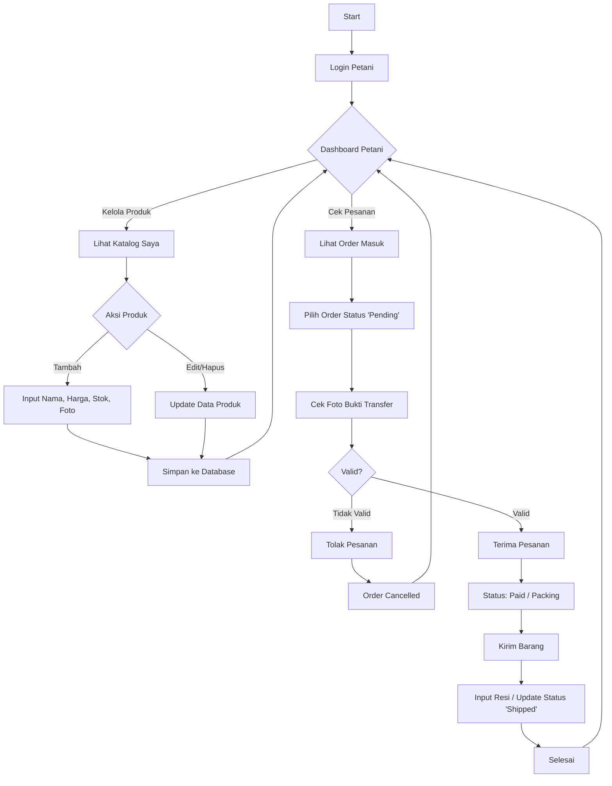

# Smart Urban Farming Marketplace - System Design Document

## 1. Kelompok dan Tema Project

**Nama Project:** Smart Urban Farming Marketplace  
**Tema:** Platform E-commerce untuk Produk Pertanian Urban  
**Mata Kuliah:** SMBDL & Pemrograman Web Lanjut  

> **Catatan:** Project ini disinkronkan dengan tugas Pemrograman Web Lanjut untuk implementasi sistem end-to-end.

---

## 2. Abstraksi Sistem Informasi

### Deskripsi Sistem
Smart Urban Farming Marketplace adalah platform jual-beli produk pertanian urban yang menghubungkan petani lokal dengan konsumen. Sistem ini dirancang untuk menangani transaksi semi-otomatis dimana sistem mampu menghitung total belanjaan secara cerdas (Harga Produk + Ongkir Spesifik Kota - Diskon Kupon), namun pembayaran tetap divalidasi secara manual melalui upload bukti transfer untuk kemudahan implementasi.

### Ruang Lingkup Proses
1. **Manajemen Katalog (Petani):** Pengelolaan data produk sayur/buah dengan status stok *ready*.
2. **Manajemen Wilayah & Tarif (Admin):** Pengaturan database kota tujuan pengiriman beserta tarif ongkos kirim tetap (*flat rate*) per kota.
3. **Manajemen Promosi (Admin):** Pembuatan kode voucher/kupon diskon dengan batasan waktu (*expired date*), usage limit, dan minimal pembelian.
4. **Keranjang & Checkout:** Sistem kalkulasi total bayar yang dinamis dengan mekanisme reserved stock (timeout 30 menit).
5. **Verifikasi Pesanan:** Validasi pembayaran manual (cek mutasi & bukti foto) oleh petani/admin.
6. **Ulasan Produk:** Pembeli dapat memberikan rating dan komentar setelah transaksi selesai.
7. **Notifikasi:** Sistem mengirim notifikasi email otomatis saat status order berubah.

### Tujuan Sistem
* **Bagi Petani:** Memperluas pasar dengan sistem pencatatan pesanan yang rapi dan transparan.
* **Bagi Pembeli:** Mendapatkan transparansi biaya kirim dan keuntungan dari promo/diskon.
* **Bagi Pengembang:** Mengimplementasikan relasi database majemuk (*One-to-Many*, *Many-to-Many*) dan logika bisnis transaksional yang kompleks.

---

## 3. Identifikasi Pengguna dan Kebutuhannya

### A. Pembeli (Customer)
**Kebutuhan Fungsional:**
* Registrasi akun dengan verifikasi email
* Melihat katalog produk berdasarkan kategori dan pencarian
* Menambahkan produk ke keranjang belanja (*Cart*) dengan stok reserved
* Memilih kota pengiriman saat checkout agar biaya ongkir muncul otomatis
* Memasukkan kode kupon (jika ada) dengan validasi realtime
* Mengunggah bukti pembayaran (format: JPG/PNG, max 2MB)
* Melacak status pesanan (Pending → Awaiting Payment → Paid → Shipped → Completed)
* Membatalkan pesanan sebelum pembayaran diverifikasi
* Memberikan ulasan (*Review*) pada item produk yang telah dibeli
* Menerima notifikasi email saat status order berubah

**Kebutuhan Non-Fungsional:**
* Password terenkripsi (bcrypt/hash)
* Session timeout 2 jam

### B. Petani (Seller)
**Kebutuhan Fungsional:**
* CRUD data produk milik sendiri (tidak bisa edit produk petani lain)
* Upload gambar produk (max 5MB, format JPG/PNG)
* Melihat daftar pesanan masuk (*Incoming Orders*) yang sudah dibayar
* Memverifikasi/menolak bukti transfer pembeli dengan alasan penolakan
* Mengupdate status pesanan menjadi "Dikirim" dengan input nomor resi
* Melihat dan merespons ulasan dari pembeli
* Mengelola informasi rekening bank untuk menerima pembayaran
* Dashboard analitik: total penjualan, produk terlaris, rating rata-rata

**Kebutuhan Non-Fungsional:**
* Role-based access control (RBAC)
* Audit log untuk perubahan data produk

### C. Admin (Platform Owner)
**Kebutuhan Fungsional:**
* Mengelola Data Kota & Tarif Ongkir (CRUD Master Data)
* Mengelola Data Kupon Diskon (Kode, Jumlah/Persentase Potongan, Masa Berlaku, Usage Limit, Min Purchase)
* Monitoring semua transaksi di platform
* Verifikasi akun petani baru (approval system)
* Broadcast notifikasi promo ke semua user
* Dashboard platform: total GMV, jumlah transaksi, user aktif

---

## 4. Desain Sistem Informasi

### A. Alur Proses (Activity Diagram)

#### **Alur Transaksi Utama (Happy Path)**



#### **Alur Exception Handling**



### **Alur Admin**



### **Alur Seller (Petani)**



### B. Rule Bisnis

#### **1. Logika Stok & Reservasi**
* Stok produk di-*reserve* saat user klik "Checkout" (belum dikurangi dari stok aktual)
* Reserved stock memiliki timeout **30 menit**. Jika user tidak upload bukti bayar dalam waktu tersebut, reserved stock akan di-release otomatis
* Stok aktual **hanya dikurangi** saat petani approve pembayaran (status: Paid)
* Jika pembayaran ditolak atau order dibatalkan, reserved stock di-release kembali

#### **2. Logika Ongkir**
* User wajib memilih kota tujuan saat checkout
* Sistem mengambil tarif ongkir dari tabel `cities` berdasarkan `city_id` yang dipilih
* Tarif ongkir bersifat *flat rate* per kota (tidak dipengaruhi berat/jumlah produk)

#### **3. Logika Kupon**
* Kupon valid jika:
  - Kode sesuai (case-insensitive)
  - Belum melewati `valid_until` (expired date)
  - Status `is_active = true`
  - Subtotal order ≥ `min_purchase`
  - Total penggunaan user < `usage_limit_per_user`
  - Total penggunaan global < `usage_limit_total` (jika ada)
* Kupon mengurangi **subtotal produk**, bukan mengurangi ongkir
* Jika `discount_amount` > `subtotal`, maka `discount_applied = subtotal` (tidak boleh negatif)
* Jika kupon bertipe persentase, hitung: `discount_applied = subtotal * (discount_percentage / 100)`
* Setiap penggunaan kupon dicatat di tabel `coupon_usage` untuk tracking

#### **4. Logika Review**
* User hanya bisa memberikan review untuk order dengan status **Completed**
* User hanya boleh review **1 kali per item** dalam 1 transaksi (tidak bisa edit review)
* Review terhubung ke `order_item_id` (bukan `product_id`), sehingga review spesifik untuk pembelian tersebut
* Rating: skala 1-5 bintang (integer)

#### **5. Logika Status Order**
Status order berjalan sequentially:
1. **Pending** → Order dibuat, menunggu upload bukti bayar
2. **Awaiting Payment** → Bukti bayar di-upload, menunggu verifikasi petani
3. **Paid** → Pembayaran diverifikasi petani, stok dikurangi
4. **Shipped** → Barang dikirim oleh petani (input nomor resi)
5. **Completed** → Pembeli konfirmasi barang diterima
6. **Cancelled** → Order dibatalkan (oleh user atau auto-timeout atau petani reject payment)

#### **6. Logika Otorisasi (RBAC)**
* Admin memiliki akses penuh ke semua fitur (super user)
* Petani hanya bisa CRUD produk milik sendiri (`farmer_id = user.id`)
* Petani hanya bisa verifikasi order yang berisi produk miliknya
* Customer hanya bisa view/update order milik sendiri
* Validasi role dilakukan dengan join ke tabel `roles` berdasarkan `role_id`

### C. Rancangan Database (ERD) & Struktur Data

*Sistem menggunakan **12 Entitas Utama** dengan relasi yang jelas.*

#### **Entity Relationship Diagram (Deskripsi Relasi)**

| Parent Table | Child Table | Relationship | Foreign Key | Cardinality |
|:---|:---|:---|:---|:---|
| **`roles`** | **`users`** | **Role dimiliki banyak user** | **`role_id`** | **1:N** |
| `users` | `products` | Farmer memiliki banyak produk | `farmer_id` | 1:N |
| `users` | `orders` | Customer membuat banyak order | `user_id` | 1:N |
| `users` | `reviews` | Customer menulis banyak review | `user_id` | 1:N |
| `users` | `farmer_banks` | Farmer memiliki banyak rekening | `farmer_id` | 1:N |
| `categories` | `products` | Kategori punya banyak produk | `category_id` | 1:N |
| `cities` | `orders` | Kota untuk banyak order | `shipping_city_id` | 1:N |
| `coupons` | `coupon_usage` | Kupon digunakan berkali-kali | `coupon_id` | 1:N |
| `orders` | `order_items` | Order punya banyak item | `order_id` | 1:N |
| `orders` | `coupon_usage` | Order bisa pakai 1 kupon | `order_id` | 1:1 (optional) |
| `products` | `order_items` | Produk dijual berkali-kali | `product_id` | 1:N |
| `order_items` | `reviews` | Item bisa punya 1 review | `order_item_id` | 1:1 (optional) |

#### **1. Tabel Master - Roles & Users**

**`roles`** - Master data role pengguna
```sql
CREATE TABLE roles (
    id INT PRIMARY KEY AUTO_INCREMENT,
    name VARCHAR(50) UNIQUE NOT NULL,
    display_name VARCHAR(100) NOT NULL,
    description TEXT,
    created_at TIMESTAMP DEFAULT CURRENT_TIMESTAMP,
    updated_at TIMESTAMP DEFAULT CURRENT_TIMESTAMP ON UPDATE CURRENT_TIMESTAMP
);

-- Index
CREATE INDEX idx_role_name ON roles(name);
```

**Data Master Roles:**
```sql
INSERT INTO roles (id, name, display_name, description) VALUES
(1, 'admin', 'Administrator', 'Pengelola platform dengan akses penuh ke semua fitur sistem'),
(2, 'farmer', 'Petani/Seller', 'Penjual produk pertanian yang dapat mengelola katalog dan order'),
(3, 'customer', 'Pembeli', 'Pengguna yang dapat membeli produk dan memberikan review');
```

**`users`** - Data pengguna sistem
```sql
CREATE TABLE users (
    id INT PRIMARY KEY AUTO_INCREMENT,
    role_id INT NOT NULL,
    name VARCHAR(100) NOT NULL,
    email VARCHAR(100) UNIQUE NOT NULL,
    password VARCHAR(255) NOT NULL COMMENT 'Hashed with bcrypt',
    address TEXT,
    phone VARCHAR(20),
    is_verified BOOLEAN DEFAULT FALSE,
    created_at TIMESTAMP DEFAULT CURRENT_TIMESTAMP,
    updated_at TIMESTAMP DEFAULT CURRENT_TIMESTAMP ON UPDATE CURRENT_TIMESTAMP,

    FOREIGN KEY (role_id) REFERENCES roles(id) ON DELETE RESTRICT,
    INDEX idx_email (email),
    INDEX idx_role (role_id),
    INDEX idx_verified (is_verified)
);
```

**Penjelasan Perubahan:**
- ✅ Kolom `role` (ENUM) **dihapus** dari tabel `users`
- ✅ Ditambahkan kolom `role_id` (INT) sebagai foreign key ke tabel `roles`
- ✅ Constraint `ON DELETE RESTRICT` mencegah penghapusan role yang masih digunakan
- ✅ Index pada `role_id` untuk optimasi query JOIN

**`farmer_banks`** - Info rekening petani
```sql
CREATE TABLE farmer_banks (
    id INT PRIMARY KEY AUTO_INCREMENT,
    farmer_id INT NOT NULL,
    bank_name VARCHAR(50) NOT NULL,
    account_number VARCHAR(30) NOT NULL,
    account_name VARCHAR(100) NOT NULL,
    is_primary BOOLEAN DEFAULT FALSE,
    created_at TIMESTAMP DEFAULT CURRENT_TIMESTAMP,

    FOREIGN KEY (farmer_id) REFERENCES users(id) ON DELETE CASCADE,
    INDEX idx_farmer (farmer_id)
);
```

#### **2. Tabel Produk & Kategori**

**`categories`** - Kategori produk
```sql
CREATE TABLE categories (
    id INT PRIMARY KEY AUTO_INCREMENT,
    name VARCHAR(50) NOT NULL,
    slug VARCHAR(50) UNIQUE NOT NULL,
    description TEXT,
    created_at TIMESTAMP DEFAULT CURRENT_TIMESTAMP
);
```

**`products`** - Data produk
```sql
CREATE TABLE products (
    id INT PRIMARY KEY AUTO_INCREMENT,
    farmer_id INT NOT NULL,
    category_id INT NOT NULL,
    name VARCHAR(100) NOT NULL,
    slug VARCHAR(100) UNIQUE NOT NULL,
    price DECIMAL(10,2) NOT NULL,
    stock INT NOT NULL DEFAULT 0,
    reserved_stock INT NOT NULL DEFAULT 0,
    unit VARCHAR(20) NOT NULL COMMENT 'kg, pcs, ikat, dll',
    description TEXT,
    image VARCHAR(255),
    is_active BOOLEAN DEFAULT TRUE,
    created_at TIMESTAMP DEFAULT CURRENT_TIMESTAMP,
    updated_at TIMESTAMP DEFAULT CURRENT_TIMESTAMP ON UPDATE CURRENT_TIMESTAMP,

    FOREIGN KEY (farmer_id) REFERENCES users(id) ON DELETE CASCADE,
    FOREIGN KEY (category_id) REFERENCES categories(id) ON DELETE RESTRICT,
    INDEX idx_farmer (farmer_id),
    INDEX idx_category (category_id),
    INDEX idx_slug (slug),
    INDEX idx_active (is_active)
);
```

#### **3. Tabel Wilayah & Ongkir**

**`cities`** - Daftar kota dan tarif
```sql
CREATE TABLE cities (
    id INT PRIMARY KEY AUTO_INCREMENT,
    city_name VARCHAR(100) NOT NULL,
    province VARCHAR(100) NOT NULL,
    shipping_cost DECIMAL(10,2) NOT NULL,
    is_active BOOLEAN DEFAULT TRUE,
    created_at TIMESTAMP DEFAULT CURRENT_TIMESTAMP,

    UNIQUE KEY unique_city (city_name, province)
);
```

#### **4. Tabel Promosi**

**`coupons`** - Data kupon diskon
```sql
CREATE TABLE coupons (
    id INT PRIMARY KEY AUTO_INCREMENT,
    code VARCHAR(20) UNIQUE NOT NULL,
    discount_type ENUM('fixed', 'percentage') NOT NULL,
    discount_amount DECIMAL(10,2) COMMENT 'Untuk tipe fixed',
    discount_percentage DECIMAL(5,2) COMMENT 'Untuk tipe percentage',
    min_purchase DECIMAL(10,2) DEFAULT 0,
    usage_limit_total INT COMMENT 'NULL = unlimited',
    usage_limit_per_user INT DEFAULT 1,
    valid_from TIMESTAMP NOT NULL,
    valid_until TIMESTAMP NOT NULL,
    is_active BOOLEAN DEFAULT TRUE,
    created_at TIMESTAMP DEFAULT CURRENT_TIMESTAMP,

    INDEX idx_code (code),
    INDEX idx_active (is_active, valid_until)
);
```

**`coupon_usage`** - Tracking penggunaan kupon
```sql
CREATE TABLE coupon_usage (
    id INT PRIMARY KEY AUTO_INCREMENT,
    coupon_id INT NOT NULL,
    user_id INT NOT NULL,
    order_id INT NOT NULL,
    discount_applied DECIMAL(10,2) NOT NULL,
    used_at TIMESTAMP DEFAULT CURRENT_TIMESTAMP,

    FOREIGN KEY (coupon_id) REFERENCES coupons(id) ON DELETE CASCADE,
    FOREIGN KEY (user_id) REFERENCES users(id) ON DELETE CASCADE,
    FOREIGN KEY (order_id) REFERENCES orders(id) ON DELETE CASCADE,
    INDEX idx_coupon_user (coupon_id, user_id),
    INDEX idx_order (order_id)
);
```

#### **5. Tabel Transaksi**

**`orders`** - Header transaksi
```sql
CREATE TABLE orders (
    id INT PRIMARY KEY AUTO_INCREMENT,
    user_id INT NOT NULL,
    shipping_city_id INT NOT NULL,
    subtotal DECIMAL(10,2) NOT NULL,
    shipping_cost DECIMAL(10,2) NOT NULL,
    discount_amount DECIMAL(10,2) DEFAULT 0,
    grand_total DECIMAL(10,2) NOT NULL,
    status ENUM('pending', 'awaiting_payment', 'paid', 'shipped', 'completed', 'cancelled') NOT NULL DEFAULT 'pending',
    payment_proof VARCHAR(255),
    payment_verified_at TIMESTAMP NULL,
    verified_by INT COMMENT 'FK to users.id (petani/admin)',
    rejection_reason TEXT,
    tracking_number VARCHAR(100),
    reserved_until TIMESTAMP COMMENT 'Waktu timeout reserved stock',
    notes TEXT,
    created_at TIMESTAMP DEFAULT CURRENT_TIMESTAMP,
    updated_at TIMESTAMP DEFAULT CURRENT_TIMESTAMP ON UPDATE CURRENT_TIMESTAMP,

    FOREIGN KEY (user_id) REFERENCES users(id) ON DELETE RESTRICT,
    FOREIGN KEY (shipping_city_id) REFERENCES cities(id) ON DELETE RESTRICT,
    FOREIGN KEY (verified_by) REFERENCES users(id) ON DELETE SET NULL,
    INDEX idx_user (user_id),
    INDEX idx_status (status),
    INDEX idx_created (created_at),
    INDEX idx_reserved (reserved_until)
);
```

**`order_items`** - Detail item transaksi
```sql
CREATE TABLE order_items (
    id INT PRIMARY KEY AUTO_INCREMENT,
    order_id INT NOT NULL,
    product_id INT NOT NULL,
    farmer_id INT NOT NULL COMMENT 'Denormalized untuk query performance',
    quantity INT NOT NULL,
    price DECIMAL(10,2) NOT NULL COMMENT 'Snapshot harga saat order',
    subtotal DECIMAL(10,2) NOT NULL,
    created_at TIMESTAMP DEFAULT CURRENT_TIMESTAMP,

    FOREIGN KEY (order_id) REFERENCES orders(id) ON DELETE CASCADE,
    FOREIGN KEY (product_id) REFERENCES products(id) ON DELETE RESTRICT,
    FOREIGN KEY (farmer_id) REFERENCES users(id) ON DELETE RESTRICT,
    INDEX idx_order (order_id),
    INDEX idx_product (product_id),
    INDEX idx_farmer (farmer_id)
);
```

#### **6. Tabel Interaksi**

**`reviews`** - Ulasan pembeli
```sql
CREATE TABLE reviews (
    id INT PRIMARY KEY AUTO_INCREMENT,
    order_item_id INT UNIQUE NOT NULL,
    user_id INT NOT NULL,
    product_id INT NOT NULL COMMENT 'Denormalized',
    rating INT NOT NULL CHECK (rating >= 1 AND rating <= 5),
    comment TEXT,
    created_at TIMESTAMP DEFAULT CURRENT_TIMESTAMP,

    FOREIGN KEY (order_item_id) REFERENCES order_items(id) ON DELETE CASCADE,
    FOREIGN KEY (user_id) REFERENCES users(id) ON DELETE CASCADE,
    FOREIGN KEY (product_id) REFERENCES products(id) ON DELETE CASCADE,
    INDEX idx_product (product_id),
    INDEX idx_user (user_id),
    INDEX idx_rating (rating)
);
```

#### **7. Tabel Keranjang**

**`carts`** - Keranjang belanja persistent
```sql
CREATE TABLE carts (
    id INT PRIMARY KEY AUTO_INCREMENT,
    user_id INT NOT NULL,
    product_id INT NOT NULL,
    quantity INT NOT NULL,
    created_at TIMESTAMP DEFAULT CURRENT_TIMESTAMP,
    updated_at TIMESTAMP DEFAULT CURRENT_TIMESTAMP ON UPDATE CURRENT_TIMESTAMP,

    FOREIGN KEY (user_id) REFERENCES users(id) ON DELETE CASCADE,
    FOREIGN KEY (product_id) REFERENCES products(id) ON DELETE CASCADE,
    UNIQUE KEY unique_cart_item (user_id, product_id),
    INDEX idx_user (user_id)
);
```

### D. Query Examples dengan Tabel Roles

#### **1. Registrasi User Baru**
```sql
-- Register sebagai customer
INSERT INTO users (role_id, name, email, password) 
VALUES (
    (SELECT id FROM roles WHERE name = 'customer'),
    'Budi Santoso',
    'budi@email.com',
    '$2y$12$hashedpassword...'
);

-- Register sebagai farmer
INSERT INTO users (role_id, name, email, password) 
VALUES (
    (SELECT id FROM roles WHERE name = 'farmer'),
    'Pak Tono',
    'tono@email.com',
    '$2y$12$hashedpassword...'
);
```

#### **2. Login & Check Role**
```sql
-- Query untuk login
SELECT 
    u.id,
    u.name,
    u.email,
    r.name as role_name,
    r.display_name as role_display
FROM users u
INNER JOIN roles r ON u.role_id = r.id
WHERE u.email = 'budi@email.com'
AND u.is_verified = TRUE;
```

#### **3. Get Users by Role**
```sql
-- Ambil semua petani
SELECT u.*
FROM users u
INNER JOIN roles r ON u.role_id = r.id
WHERE r.name = 'farmer';

-- Ambil semua customer
SELECT u.*
FROM users u
INNER JOIN roles r ON u.role_id = r.id
WHERE r.name = 'customer';
```

#### **4. Check User Permission**
```sql
-- Cek apakah user adalah admin
SELECT EXISTS(
    SELECT 1 FROM users u
    INNER JOIN roles r ON u.role_id = r.id
    WHERE u.id = ? AND r.name = 'admin'
) as is_admin;

-- Cek apakah user adalah farmer untuk edit produk
SELECT EXISTS(
    SELECT 1 FROM products p
    INNER JOIN users u ON p.farmer_id = u.id
    INNER JOIN roles r ON u.role_id = r.id
    WHERE p.id = ? AND u.id = ? AND r.name = 'farmer'
) as can_edit;
```

#### **5. Dashboard Query dengan Role Join**
```sql
-- Admin: Total users per role
SELECT 
    r.display_name as role,
    COUNT(u.id) as total_users
FROM roles r
LEFT JOIN users u ON r.id = u.role_id
GROUP BY r.id, r.display_name;

-- Farmer: Produk saya
SELECT p.*
FROM products p
INNER JOIN users u ON p.farmer_id = u.id
INNER JOIN roles r ON u.role_id = r.id
WHERE u.id = ? AND r.name = 'farmer';
```

### E. Sampling Data & Skenario Transaksi

#### **Setup Data Master**
```sql
-- Roles (sudah ada)
INSERT INTO roles VALUES
(1, 'admin', 'Administrator', 'Full access'),
(2, 'farmer', 'Petani/Seller', 'Product management'),
(3, 'customer', 'Pembeli', 'Shopping & review');

-- Users dengan role_id
INSERT INTO users (id, role_id, name, email, password, is_verified) VALUES
(1, 1, 'Admin System', 'admin@farmmarket.com', '$2y$12$hash...', TRUE),
(2, 2, 'Pak Tono', 'tono@farmer.com', '$2y$12$hash...', TRUE),
(3, 2, 'Bu Siti', 'siti@farmer.com', '$2y$12$hash...', TRUE),
(5, 3, 'Budi Santoso', 'budi@customer.com', '$2y$12$hash...', TRUE),
(8, 3, 'Ani Wijaya', 'ani@customer.com', '$2y$12$hash...', TRUE);

-- Categories
INSERT INTO categories VALUES
(1, 'Sayuran', 'sayuran', 'Produk sayuran segar'),
(2, 'Buah-buahan', 'buah-buahan', 'Produk buah segar');

-- Products
INSERT INTO products (id, farmer_id, category_id, name, slug, price, stock, unit) VALUES
(10, 2, 1, 'Wortel Organik', 'wortel-organik', 10000, 50, 'kg'),
(15, 3, 1, 'Bayam Segar', 'bayam-segar', 8000, 30, 'kg'),
(20, 2, 2, 'Tomat Merah', 'tomat-merah', 12000, 40, 'kg');

-- Cities
INSERT INTO cities VALUES
(7, 'Bogor', 'Jawa Barat', 15000, TRUE, NOW()),
(9, 'Jakarta Selatan', 'DKI Jakarta', 20000, TRUE, NOW());

-- Coupons
INSERT INTO coupons VALUES
(1, 'PROMO10', 'fixed', 10000, NULL, 15000, NULL, 1, NOW(), '2025-12-31', TRUE, NOW());
```

#### **Skenario 1: Order dengan Kupon (Happy Path)**

**Setup Data:**
- **User:** Budi (Customer, role_id: 3, ID: 5)
- **Produk:** 
  - Wortel Organik (@Rp 10.000/kg, stok: 50 kg, Farmer: Pak Tono ID: 2)
  - Bayam Segar (@Rp 8.000/kg, stok: 30 kg, Farmer: Bu Siti ID: 3)
- **Kota Tujuan:** Bogor (Ongkir: Rp 15.000)
- **Kupon:** PROMO10 (Fixed Rp 10.000, Min Purchase: Rp 15.000, Valid)

**Proses:**
1. Budi add 2 kg Wortel + 3 kg Bayam ke cart
2. Checkout → Pilih Kota Bogor → Input kupon PROMO10
3. Sistem kalkulasi:

| Komponen | Perhitungan | Nilai |
|:---|:---|---:|
| Wortel (2 kg × Rp 10.000) | | Rp 20.000 |
| Bayam (3 kg × Rp 8.000) | | Rp 24.000 |
| **Subtotal** | 20.000 + 24.000 | **Rp 44.000** |
| Validasi Kupon | Subtotal ≥ Min Purchase? | ✅ (44k ≥ 15k) |
| **Diskon Kupon** | | **-Rp 10.000** |
| **Ongkir (Bogor)** | | **Rp 15.000** |
| **Grand Total** | 44.000 - 10.000 + 15.000 | **Rp 49.000** |

4. **Database Changes:**

```sql
-- Tabel orders
INSERT INTO orders VALUES (
  101, -- id
  5, -- user_id (Budi, role_id = 3)
  7, -- shipping_city_id (Bogor)
  44000, -- subtotal
  15000, -- shipping_cost
  10000, -- discount_amount
  49000, -- grand_total
  'pending', -- status
  NULL, -- payment_proof
  NULL, -- payment_verified_at
  NULL, -- verified_by
  NULL, -- rejection_reason
  NULL, -- tracking_number
  NOW() + INTERVAL 30 MINUTE, -- reserved_until
  NULL, -- notes
  NOW(), -- created_at
  NOW() -- updated_at
);

-- Tabel order_items
INSERT INTO order_items VALUES 
  (201, 101, 10, 2, 2, 10000, 20000, NOW()), -- Wortel, farmer_id=2
  (202, 101, 15, 3, 3, 8000, 24000, NOW()); -- Bayam, farmer_id=3

-- Reserved stock
UPDATE products SET reserved_stock = reserved_stock + 2 WHERE id = 10;
UPDATE products SET reserved_stock = reserved_stock + 3 WHERE id = 15;

-- Coupon usage tracking
INSERT INTO coupon_usage VALUES (
  NULL, -- id
  1, -- coupon_id
  5, -- user_id
  101, -- order_id
  10000, -- discount_applied
  NOW() -- used_at
);
```

5. Budi upload bukti transfer → Status: `awaiting_payment`
6. Pak Tono (role_id = 2) approve payment → Status: `paid`

```sql
-- Update order status
UPDATE orders 
SET status = 'paid',
    payment_verified_at = NOW(),
    verified_by = 2  -- Pak Tono (farmer)
WHERE id = 101;

-- Kurangi stok real
UPDATE products 
SET stock = stock - 2, 
    reserved_stock = reserved_stock - 2 
WHERE id = 10;

UPDATE products 
SET stock = stock - 3, 
    reserved_stock = reserved_stock - 3 
WHERE id = 15;
```

7. **Verification Query (Role-based)**

```sql
-- Cek apakah Pak Tono boleh verify order ini
SELECT EXISTS(
    SELECT 1 
    FROM orders o
    INNER JOIN order_items oi ON o.id = oi.order_id
    INNER JOIN users u ON oi.farmer_id = u.id
    INNER JOIN roles r ON u.role_id = r.id
    WHERE o.id = 101 
    AND u.id = 2 -- Pak Tono
    AND r.name = 'farmer'
) as can_verify;
-- Result: TRUE (karena order 101 punya produk dari Pak Tono)
```

#### **Skenario 2: Role Permission Check**

**Case 1: Farmer Edit Product**
```sql
-- Pak Tono (id=2) coba edit produk id=10 (miliknya sendiri)
SELECT 
    p.*,
    u.name as farmer_name,
    r.name as role_name
FROM products p
INNER JOIN users u ON p.farmer_id = u.id
INNER JOIN roles r ON u.role_id = r.id
WHERE p.id = 10 
AND u.id = 2 
AND r.name = 'farmer';
-- Result: OK, boleh edit

-- Pak Tono coba edit produk id=15 (milik Bu Siti)
SELECT 
    p.*,
    u.name as farmer_name,
    r.name as role_name
FROM products p
INNER JOIN users u ON p.farmer_id = u.id
INNER JOIN roles r ON u.role_id = r.id
WHERE p.id = 15 
AND u.id = 2 
AND r.name = 'farmer';
-- Result: EMPTY, tidak boleh edit (bukan pemilik)
```

**Case 2: Admin Full Access**
```sql
-- Admin bisa edit semua produk
SELECT p.*
FROM products p
WHERE EXISTS(
    SELECT 1 FROM users u
    INNER JOIN roles r ON u.role_id = r.id
    WHERE u.id = 1 -- Admin
    AND r.name = 'admin'
);
-- Result: Semua produk
```

**Case 3: Customer View Orders**
```sql
-- Budi (id=5, customer) lihat order miliknya
SELECT 
    o.*,
    u.name as customer_name,
    r.name as role_name
FROM orders o
INNER JOIN users u ON o.user_id = u.id
INNER JOIN roles r ON u.role_id = r.id
WHERE u.id = 5 
AND r.name = 'customer';
-- Result: Orders milik Budi saja
```

### F. Migration Scripts

#### **Migration: Separate Role from Users Table**

Jika sebelumnya sudah ada database dengan `users.role` (ENUM), ini script untuk migrasi:

```sql
-- Step 1: Buat tabel roles
CREATE TABLE roles (
    id INT PRIMARY KEY AUTO_INCREMENT,
    name VARCHAR(50) UNIQUE NOT NULL,
    display_name VARCHAR(100) NOT NULL,
    description TEXT,
    created_at TIMESTAMP DEFAULT CURRENT_TIMESTAMP,
    updated_at TIMESTAMP DEFAULT CURRENT_TIMESTAMP ON UPDATE CURRENT_TIMESTAMP
);

-- Step 2: Insert master data roles
INSERT INTO roles (id, name, display_name, description) VALUES
(1, 'admin', 'Administrator', 'Pengelola platform dengan akses penuh'),
(2, 'farmer', 'Petani/Seller', 'Penjual produk pertanian'),
(3, 'customer', 'Pembeli', 'Pembeli produk');

-- Step 3: Tambah kolom role_id di users (temporary nullable)
ALTER TABLE users ADD COLUMN role_id INT NULL AFTER id;

-- Step 4: Migrasi data dari ENUM ke role_id
UPDATE users SET role_id = 1 WHERE role = 'admin';
UPDATE users SET role_id = 2 WHERE role = 'farmer';
UPDATE users SET role_id = 3 WHERE role = 'customer';

-- Step 5: Set role_id menjadi NOT NULL
ALTER TABLE users MODIFY role_id INT NOT NULL;

-- Step 6: Tambah foreign key
ALTER TABLE users 
ADD CONSTRAINT fk_users_role 
FOREIGN KEY (role_id) REFERENCES roles(id) ON DELETE RESTRICT;

-- Step 7: Tambah index
CREATE INDEX idx_users_role ON users(role_id);

-- Step 8: Hapus kolom role lama (ENUM)
ALTER TABLE users DROP COLUMN role;

-- Step 9: Verify
SELECT 
    u.id,
    u.name,
    u.email,
    r.name as role_name,
    r.display_name
FROM users u
INNER JOIN roles r ON u.role_id = r.id;
```

---

## 5. Non-Functional Requirements

### **Keamanan (Security)**
- Password hashing menggunakan bcrypt (cost factor: 12)
- HTTPS untuk semua endpoint
- Input validation & sanitization untuk prevent SQL Injection, XSS
- File upload validation:
  - Format: JPG, PNG only
  - Max size: 5MB untuk gambar produk, 2MB untuk bukti bayar
  - Rename file dengan UUID untuk prevent overwrite
- CSRF protection untuk form submission
- Rate limiting: 100 requests/minute per IP
- Role validation menggunakan JOIN ke tabel `roles` dengan indexed queries

### **Performa (Performance)**
- Database indexing:
  - `roles(name)` untuk query role checking
  - `users(email, role_id)` untuk authentication & authorization
  - `products(slug, farmer_id)` untuk catalog & ownership
  - `orders(user_id, status)` untuk order listing
  - `coupon_usage(coupon_id, user_id)` untuk validation
  - `order_items(order_id, farmer_id)` untuk multi-table joins
- Pagination: Max 20 items per page
- Image compression: Max 800×800px untuk display
- Cache master data (`roles`, `cities`, `categories`) untuk 1 jam
- Denormalized columns (`farmer_id` di `order_items`, `product_id` di `reviews`) untuk mengurangi nested JOIN

### **Ketersediaan (Availability)**
- Scheduled job untuk auto-cancel expired reserved stock (cron: every 5 minutes)
- Email queue untuk notifikasi (async processing)
- Database backup: Daily incremental, Weekly full backup
- Foreign key constraint dengan proper ON DELETE action:
  - `ON DELETE RESTRICT`: Untuk referensi penting (products, orders)
  - `ON DELETE CASCADE`: Untuk dependent data (order_items, reviews, carts)
  - `ON DELETE SET NULL`: Untuk optional references (verified_by)

### **Usability**
- Responsive design (mobile-first)
- Loading indicator untuk proses async
- Error message yang jelas dan actionable
- Breadcrumb navigation untuk UX
- Display role name yang user-friendly (`display_name` dari tabel `roles`)

---

## 6. Diskusi & Konsultasi FP

### **Pertanyaan untuk Dosen/Pembimbing:**

1. **Scope MVP:** Apakah fitur notifikasi email wajib diimplementasikan, atau bisa diganti dengan in-app notification saja?
2. **Multi-Farmer Order:** Apakah boleh split order otomatis jika user checkout produk dari >1 petani?
3. **Payment Gateway:** Apakah boleh manual transfer dulu untuk MVP, atau wajib integrasi payment gateway (Midtrans/Xendit)?
4. **Stock Reservation:** Timeout 30 menit sudah cukup wajar?
5. **Kupon Usage Limit:** Apakah perlu fitur "1 kupon per transaksi" atau boleh multiple kupon?
6. **Teknologi:** Stack yang direkomendasikan: Laravel/CodeIgniter untuk backend, Vue/React untuk frontend?
7. **Role Table:** Apakah tabel `roles` terpisah sudah cukup, atau perlu permission table yang lebih granular?

### **Risiko Implementasi:**

| Risiko | Mitigasi |
|:---|:---|
| Reserved stock tidak ter-release otomatis | Buat cron job + unit test untuk timeout mechanism |
| Race condition saat checkout bersamaan | Implement database transaction + row locking (FOR UPDATE) |
| File upload vulnerability | Strict validation + virus scan (ClamAV) |
| Email delivery failure | Gunakan queue + retry mechanism (max 3×) |
| Kupon abuse (bot spam) | Captcha + rate limiting per user |
| Foreign key cascade unintended deletion | Careful ON DELETE strategy, backup before production |
| Role assignment error | Validation layer di aplikasi + database constraint |

### **Timeline Estimasi (8 Minggu):**

| Week | Task | Deliverable |
|:---:|:---|:---|
| 1-2 | Database design & setup, Authentication with Roles | ERD implemented, Role-based registration/login |
| 3 | Product catalog CRUD with role check | Farmer can manage own products only |
| 4 | Checkout flow, Stock reservation | Working checkout with coupon & shipping |
| 5 | Order management, Payment verification | Role-based order access & verification |
| 6 | Review system, Admin dashboard | Review feature, Role analytics dashboard |
| 7 | Testing, Bug fixing, Role permission testing | All features tested, security audit |
| 8 | Deployment, Documentation | Live demo, complete documentation |

---

## Changelog

**Version 1.2** (2025-12-14)
- ✅ **MAJOR:** Kolom `role` (ENUM) dipindahkan ke tabel `roles` terpisah
- ✅ Added: Tabel `roles` dengan master data (admin, farmer, customer)
- ✅ Modified: Tabel `users` sekarang menggunakan `role_id` (INT) sebagai FK
- ✅ Added: ERD relationship `roles` → `users` (1:N)
- ✅ Added: Migration script untuk konversi dari ENUM ke relational table
- ✅ Updated: Semua query examples menggunakan JOIN ke tabel `roles`
- ✅ Updated: Sampling data menggunakan `role_id` instead of role string
- ✅ Added: Role permission check examples dengan JOIN queries
- ✅ Improved: Indexing strategy untuk role-based queries
- ✅ Added: Foreign key constraint dengan ON DELETE RESTRICT untuk roles
- ✅ Improved: Security & performance considerations untuk tabel roles

**Version 1.1** (2025-12-08)
- ✅ Added: Kelompok & tema section
- ✅ Improved: Detailed rule bisnis untuk stok, kupon, otorisasi
- ✅ Added: Exception handling flow diagram
- ✅ Improved: ERD dengan relasi eksplisit & foreign key
- ✅ Added: Tabel `coupon_usage`, `farmer_banks`, `carts`
- ✅ Improved: Struktur kolom dengan constraint (NOT NULL, UNIQUE, CHECK)
- ✅ Added: 5 skenario transaksi termasuk edge cases
- ✅ Added: Non-functional requirements (security, performance)
- ✅ Added: Diskusi & timeline implementasi
- ✅ Fixed: Ambiguitas timing pengurangan stok
- ✅ Fixed: Review relation ke `order_item_id`

---

## Summary

**Total Entitas:** 12 tabel (bertambah 1: `roles`)  
**Total Rule Bisnis:** 6 kategori aturan  
**Total Skenario:** 5 test cases  
**Estimasi LOC:** ~5500 baris (backend + frontend)  
**Database Normalization:** 3NF (Third Normal Form)  
**RBAC Implementation:** Relational table-based (Scalable & Maintainable)

**Keunggulan Tabel Roles Terpisah:**
- ✅ Mudah menambah role baru tanpa alter table users
- ✅ Bisa menambahkan atribut role (permissions, hierarchy) di masa depan
- ✅ Query lebih fleksibel dengan JOIN
- ✅ Memenuhi prinsip normalisasi database (3NF)
- ✅ Maintainable untuk sistem yang berkembang
