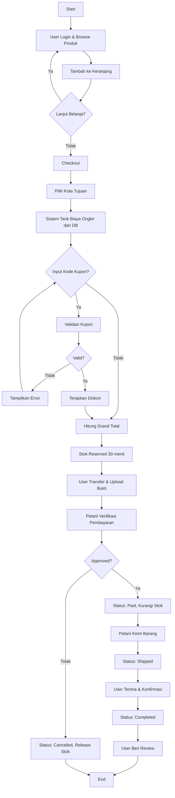
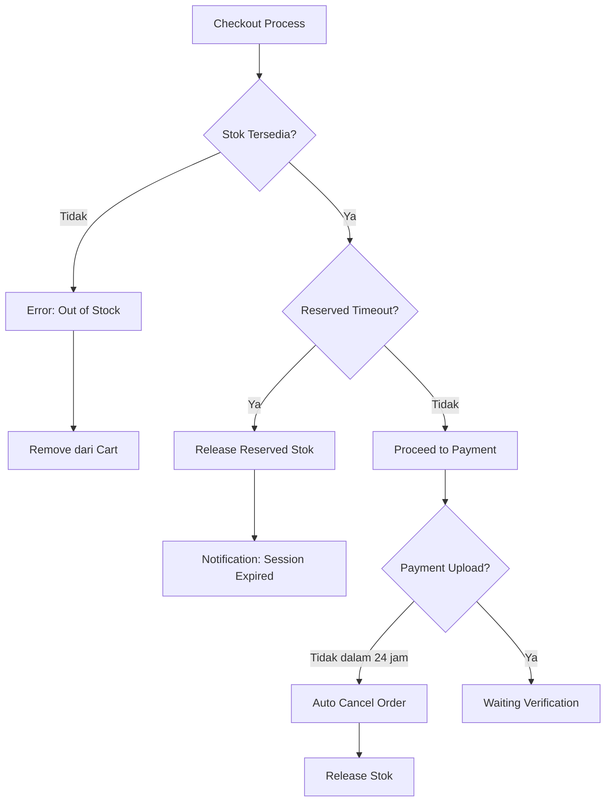

# Smart Urban Farming Marketplace - System Design Document

## 1. Kelompok dan Tema Project

**Nama Project:** Smart Urban Farming Marketplace  
**Tema:** Platform E-commerce untuk Produk Pertanian Urban  
**Mata Kuliah:** SMBDL & Pemrograman Web Lanjut  

> **Catatan:** Project ini disinkronkan dengan tugas Pemrograman Web Lanjut untuk implementasi sistem end-to-end.

---

## 2. Abstraksi Sistem Informasi

### Deskripsi Sistem
Smart Urban Farming Marketplace adalah platform jual-beli produk pertanian urban yang menghubungkan petani lokal dengan konsumen. Sistem ini dirancang untuk menangani transaksi semi-otomatis dimana sistem mampu menghitung total belanjaan secara cerdas (Harga Produk + Ongkir Spesifik Kota - Diskon Kupon), namun pembayaran tetap divalidasi secara manual melalui upload bukti transfer untuk kemudahan implementasi.

### Ruang Lingkup Proses
1. **Manajemen Katalog (Petani):** Pengelolaan data produk sayur/buah dengan status stok *ready*.
2. **Manajemen Wilayah & Tarif (Admin):** Pengaturan database kota tujuan pengiriman beserta tarif ongkos kirim tetap (*flat rate*) per kota.
3. **Manajemen Promosi (Admin):** Pembuatan kode voucher/kupon diskon dengan batasan waktu (*expired date*), usage limit, dan minimal pembelian.
4. **Keranjang & Checkout:** Sistem kalkulasi total bayar yang dinamis dengan mekanisme reserved stock (timeout 30 menit).
5. **Verifikasi Pesanan:** Validasi pembayaran manual (cek mutasi & bukti foto) oleh petani/admin.
6. **Ulasan Produk:** Pembeli dapat memberikan rating dan komentar setelah transaksi selesai.
7. **Notifikasi:** Sistem mengirim notifikasi email otomatis saat status order berubah.

### Tujuan Sistem
* **Bagi Petani:** Memperluas pasar dengan sistem pencatatan pesanan yang rapi dan transparan.
* **Bagi Pembeli:** Mendapatkan transparansi biaya kirim dan keuntungan dari promo/diskon.
* **Bagi Pengembang:** Mengimplementasikan relasi database majemuk (*One-to-Many*, *Many-to-Many*) dan logika bisnis transaksional yang kompleks.

---

## 3. Identifikasi Pengguna dan Kebutuhannya

### A. Pembeli (Customer)
**Kebutuhan Fungsional:**
* Registrasi akun dengan verifikasi email
* Melihat katalog produk berdasarkan kategori dan pencarian
* Menambahkan produk ke keranjang belanja (*Cart*) dengan stok reserved
* Memilih kota pengiriman saat checkout agar biaya ongkir muncul otomatis
* Memasukkan kode kupon (jika ada) dengan validasi realtime
* Mengunggah bukti pembayaran (format: JPG/PNG, max 2MB)
* Melacak status pesanan (Pending → Awaiting Payment → Paid → Shipped → Completed)
* Membatalkan pesanan sebelum pembayaran diverifikasi
* Memberikan ulasan (*Review*) pada item produk yang telah dibeli
* Menerima notifikasi email saat status order berubah

**Kebutuhan Non-Fungsional:**
* Password terenkripsi (bcrypt/hash)
* Session timeout 2 jam

### B. Petani (Seller)
**Kebutuhan Fungsional:**
* CRUD data produk milik sendiri (tidak bisa edit produk petani lain)
* Upload gambar produk (max 5MB, format JPG/PNG)
* Melihat daftar pesanan masuk (*Incoming Orders*) yang sudah dibayar
* Memverifikasi/menolak bukti transfer pembeli dengan alasan penolakan
* Mengupdate status pesanan menjadi "Dikirim" dengan input nomor resi
* Melihat dan merespons ulasan dari pembeli
* Mengelola informasi rekening bank untuk menerima pembayaran
* Dashboard analitik: total penjualan, produk terlaris, rating rata-rata

**Kebutuhan Non-Fungsional:**
* Role-based access control (RBAC)
* Audit log untuk perubahan data produk

### C. Admin (Platform Owner)
**Kebutuhan Fungsional:**
* Mengelola Data Kota & Tarif Ongkir (CRUD Master Data)
* Mengelola Data Kupon Diskon (Kode, Jumlah/Persentase Potongan, Masa Berlaku, Usage Limit, Min Purchase)
* Monitoring semua transaksi di platform
* Verifikasi akun petani baru (approval system)
* Broadcast notifikasi promo ke semua user
* Dashboard platform: total GMV, jumlah transaksi, user aktif

---

## 4. Desain Sistem Informasi

### A. Alur Proses (Activity Diagram)

#### **Alur Transaksi Utama (Happy Path)**



#### **Alur Exception Handling**



### B. Rule Bisnis

#### **1. Logika Stok & Reservasi**
* Stok produk di-*reserve* saat user klik "Checkout" (belum dikurangi dari stok aktual)
* Reserved stock memiliki timeout **30 menit**. Jika user tidak upload bukti bayar dalam waktu tersebut, reserved stock akan di-release otomatis
* Stok aktual **hanya dikurangi** saat petani approve pembayaran (status: Paid)
* Jika pembayaran ditolak atau order dibatalkan, reserved stock di-release kembali

#### **2. Logika Ongkir**
* User wajib memilih kota tujuan saat checkout
* Sistem mengambil tarif ongkir dari tabel `cities` berdasarkan `city_id` yang dipilih
* Tarif ongkir bersifat *flat rate* per kota (tidak dipengaruhi berat/jumlah produk)

#### **3. Logika Kupon**
* Kupon valid jika:
  - Kode sesuai (case-insensitive)
  - Belum melewati `valid_until` (expired date)
  - Status `is_active = true`
  - Subtotal order ≥ `min_purchase`
  - Total penggunaan user < `usage_limit_per_user`
  - Total penggunaan global < `usage_limit_total` (jika ada)
* Kupon mengurangi **subtotal produk**, bukan mengurangi ongkir
* Jika `discount_amount` > `subtotal`, maka `discount_applied = subtotal` (tidak boleh negatif)
* Jika kupon bertipe persentase, hitung: `discount_applied = subtotal * (discount_percentage / 100)`
* Setiap penggunaan kupon dicatat di tabel `coupon_usage` untuk tracking

#### **4. Logika Review**
* User hanya bisa memberikan review untuk order dengan status **Completed**
* User hanya boleh review **1 kali per item** dalam 1 transaksi (tidak bisa edit review)
* Review terhubung ke `order_item_id` (bukan `product_id`), sehingga review spesifik untuk pembelian tersebut
* Rating: skala 1-5 bintang (integer)

#### **5. Logika Status Order**
Status order berjalan sequentially:
1. **Pending** → Order dibuat, menunggu upload bukti bayar
2. **Awaiting Payment** → Bukti bayar di-upload, menunggu verifikasi petani
3. **Paid** → Pembayaran diverifikasi petani, stok dikurangi
4. **Shipped** → Barang dikirim oleh petani (input nomor resi)
5. **Completed** → Pembeli konfirmasi barang diterima
6. **Cancelled** → Order dibatalkan (oleh user atau auto-timeout atau petani reject payment)

#### **6. Logika Otorisasi**
* Petani hanya bisa CRUD produk milik sendiri (`farmer_id = user.id`)
* Petani hanya bisa verifikasi order yang berisi produk miliknya
* Admin memiliki akses penuh ke semua fitur (super user)

### C. Rancangan Database (ERD) & Struktur Data

*Sistem menggunakan **11 Entitas Utama** dengan relasi yang jelas.*

#### **Entity Relationship Diagram (Deskripsi Relasi)**

| Parent Table | Child Table | Relationship | Foreign Key | Cardinality |
|:---|:---|:---|:---|:---|
| `users` | `products` | Farmer memiliki banyak produk | `farmer_id` | 1:N |
| `users` | `orders` | Customer membuat banyak order | `user_id` | 1:N |
| `users` | `reviews` | Customer menulis banyak review | `user_id` | 1:N |
| `users` | `farmer_banks` | Farmer memiliki banyak rekening | `farmer_id` | 1:N |
| `categories` | `products` | Kategori punya banyak produk | `category_id` | 1:N |
| `cities` | `orders` | Kota untuk banyak order | `shipping_city_id` | 1:N |
| `coupons` | `coupon_usage` | Kupon digunakan berkali-kali | `coupon_id` | 1:N |
| `orders` | `order_items` | Order punya banyak item | `order_id` | 1:N |
| `orders` | `coupon_usage` | Order bisa pakai 1 kupon | `order_id` | 1:1 (optional) |
| `products` | `order_items` | Produk dijual berkali-kali | `product_id` | 1:N |
| `order_items` | `reviews` | Item bisa punya 1 review | `order_item_id` | 1:1 (optional) |

#### **1. Tabel Master & User**

**`users`** - Data pengguna sistem
```
id (PK, INT, AUTO_INCREMENT)
name (VARCHAR 100, NOT NULL)
email (VARCHAR 100, UNIQUE, NOT NULL)
password (VARCHAR 255, NOT NULL, hashed)
role (ENUM: 'admin', 'farmer', 'customer', NOT NULL)
address (TEXT, NULLABLE)
phone (VARCHAR 20, NULLABLE)
is_verified (BOOLEAN, DEFAULT false)
created_at (TIMESTAMP)
updated_at (TIMESTAMP)
```

**`farmer_banks`** - Info rekening petani
```
id (PK, INT, AUTO_INCREMENT)
farmer_id (FK -> users.id, NOT NULL)
bank_name (VARCHAR 50, NOT NULL)
account_number (VARCHAR 30, NOT NULL)
account_name (VARCHAR 100, NOT NULL)
is_primary (BOOLEAN, DEFAULT false)
created_at (TIMESTAMP)
```

#### **2. Tabel Produk & Kategori**

**`categories`** - Kategori produk
```
id (PK, INT, AUTO_INCREMENT)
name (VARCHAR 50, NOT NULL)
slug (VARCHAR 50, UNIQUE, NOT NULL)
description (TEXT, NULLABLE)
created_at (TIMESTAMP)
```

**`products`** - Data produk
```
id (PK, INT, AUTO_INCREMENT)
farmer_id (FK -> users.id, NOT NULL)
category_id (FK -> categories.id, NOT NULL)
name (VARCHAR 100, NOT NULL)
slug (VARCHAR 100, UNIQUE, NOT NULL)
price (DECIMAL 10,2, NOT NULL)
stock (INT, NOT NULL, DEFAULT 0)
reserved_stock (INT, NOT NULL, DEFAULT 0)
unit (VARCHAR 20, NOT NULL, e.g. 'kg', 'pcs')
description (TEXT, NULLABLE)
image (VARCHAR 255, NULLABLE)
is_active (BOOLEAN, DEFAULT true)
created_at (TIMESTAMP)
updated_at (TIMESTAMP)
```

#### **3. Tabel Wilayah & Ongkir**

**`cities`** - Daftar kota dan tarif
```
id (PK, INT, AUTO_INCREMENT)
city_name (VARCHAR 100, NOT NULL, UNIQUE)
province (VARCHAR 100, NOT NULL)
shipping_cost (DECIMAL 10,2, NOT NULL)
is_active (BOOLEAN, DEFAULT true)
created_at (TIMESTAMP)
```

#### **4. Tabel Promosi**

**`coupons`** - Data kupon diskon
```
id (PK, INT, AUTO_INCREMENT)
code (VARCHAR 20, UNIQUE, NOT NULL)
discount_type (ENUM: 'fixed', 'percentage', NOT NULL)
discount_amount (DECIMAL 10,2, NULLABLE, for fixed)
discount_percentage (DECIMAL 5,2, NULLABLE, for percentage)
min_purchase (DECIMAL 10,2, DEFAULT 0)
usage_limit_total (INT, NULLABLE, NULL = unlimited)
usage_limit_per_user (INT, DEFAULT 1)
valid_from (TIMESTAMP, NOT NULL)
valid_until (TIMESTAMP, NOT NULL)
is_active (BOOLEAN, DEFAULT true)
created_at (TIMESTAMP)
```

**`coupon_usage`** - Tracking penggunaan kupon
```
id (PK, INT, AUTO_INCREMENT)
coupon_id (FK -> coupons.id, NOT NULL)
user_id (FK -> users.id, NOT NULL)
order_id (FK -> orders.id, NOT NULL)
discount_applied (DECIMAL 10,2, NOT NULL)
used_at (TIMESTAMP)
```

#### **5. Tabel Transaksi**

**`orders`** - Header transaksi
```
id (PK, INT, AUTO_INCREMENT)
user_id (FK -> users.id, NOT NULL)
shipping_city_id (FK -> cities.id, NOT NULL)
subtotal (DECIMAL 10,2, NOT NULL)
shipping_cost (DECIMAL 10,2, NOT NULL)
discount_amount (DECIMAL 10,2, DEFAULT 0)
grand_total (DECIMAL 10,2, NOT NULL)
status (ENUM: 'pending', 'awaiting_payment', 'paid', 'shipped', 'completed', 'cancelled', NOT NULL)
payment_proof (VARCHAR 255, NULLABLE)
payment_verified_at (TIMESTAMP, NULLABLE)
verified_by (FK -> users.id, NULLABLE, petani/admin)
rejection_reason (TEXT, NULLABLE)
tracking_number (VARCHAR 100, NULLABLE)
reserved_until (TIMESTAMP, NULLABLE, for stock reservation)
notes (TEXT, NULLABLE)
created_at (TIMESTAMP)
updated_at (TIMESTAMP)
```

**`order_items`** - Detail item transaksi
```
id (PK, INT, AUTO_INCREMENT)
order_id (FK -> orders.id, NOT NULL)
product_id (FK -> products.id, NOT NULL)
farmer_id (FK -> users.id, NOT NULL, denormalized for query)
quantity (INT, NOT NULL)
price (DECIMAL 10,2, NOT NULL, snapshot harga saat order)
subtotal (DECIMAL 10,2, NOT NULL)
created_at (TIMESTAMP)
```

#### **6. Tabel Interaksi**

**`reviews`** - Ulasan pembeli
```
id (PK, INT, AUTO_INCREMENT)
order_item_id (FK -> order_items.id, UNIQUE, NOT NULL)
user_id (FK -> users.id, NOT NULL)
product_id (FK -> products.id, NOT NULL, denormalized)
rating (INT, NOT NULL, CHECK 1-5)
comment (TEXT, NULLABLE)
created_at (TIMESTAMP)
```

#### **7. Tabel Keranjang (Opsional)**

**`carts`** - Keranjang belanja persistent
```
id (PK, INT, AUTO_INCREMENT)
user_id (FK -> users.id, NOT NULL)
product_id (FK -> products.id, NOT NULL)
quantity (INT, NOT NULL)
created_at (TIMESTAMP)
updated_at (TIMESTAMP)

UNIQUE KEY (user_id, product_id)
```

### D. Sampling Data & Skenario Transaksi

#### **Skenario 1: Order dengan Kupon (Happy Path)**

**Setup Data:**
- **User:** Budi (Customer, ID: 5)
- **Produk:** 
  - Wortel Organik (@Rp 10.000/kg, stok: 50 kg, Farmer: Pak Tono ID: 2)
  - Bayam Segar (@Rp 8.000/kg, stok: 30 kg, Farmer: Bu Siti ID: 3)
- **Kota Tujuan:** Bogor (Ongkir: Rp 15.000)
- **Kupon:** PROMO10 (Fixed Rp 10.000, Min Purchase: Rp 15.000, Valid)

**Proses:**
1. Budi add 2 kg Wortel + 3 kg Bayam ke cart
2. Checkout → Pilih Kota Bogor → Input kupon PROMO10
3. Sistem kalkulasi:

| Komponen | Perhitungan | Nilai |
|:---|:---|---:|
| Wortel (2 kg × Rp 10.000) | | Rp 20.000 |
| Bayam (3 kg × Rp 8.000) | | Rp 24.000 |
| **Subtotal** | 20.000 + 24.000 | **Rp 44.000** |
| Validasi Kupon | Subtotal ≥ Min Purchase? | ✅ (44k ≥ 15k) |
| **Diskon Kupon** | | **-Rp 10.000** |
| **Ongkir (Bogor)** | | **Rp 15.000** |
| **Grand Total** | 44.000 - 10.000 + 15.000 | **Rp 49.000** |

4. **Database Changes:**

```sql
-- Tabel orders
INSERT INTO orders VALUES (
  id: 101,
  user_id: 5,
  shipping_city_id: 7 (Bogor),
  subtotal: 44000,
  shipping_cost: 15000,
  discount_amount: 10000,
  grand_total: 49000,
  status: 'pending',
  reserved_until: NOW() + INTERVAL 30 MINUTE
);

-- Tabel order_items
INSERT INTO order_items VALUES 
  (id: 201, order_id: 101, product_id: 10, farmer_id: 2, quantity: 2, price: 10000, subtotal: 20000),
  (id: 202, order_id: 101, product_id: 15, farmer_id: 3, quantity: 3, price: 8000, subtotal: 24000);

-- Reserved stock
UPDATE products SET reserved_stock = reserved_stock + 2 WHERE id = 10;
UPDATE products SET reserved_stock = reserved_stock + 3 WHERE id = 15;

-- Coupon usage tracking
INSERT INTO coupon_usage VALUES (
  coupon_id: 1,
  user_id: 5,
  order_id: 101,
  discount_applied: 10000,
  used_at: NOW()
);
```

5. Budi upload bukti transfer → Status: `awaiting_payment`
6. Pak Tono approve payment → Status: `paid`
7. **Stok Real Dikurangi:**

```sql
UPDATE products SET stock = stock - 2, reserved_stock = reserved_stock - 2 WHERE id = 10;
UPDATE products SET stock = stock - 3, reserved_stock = reserved_stock - 3 WHERE id = 15;
```

#### **Skenario 2: Order Tanpa Kupon**

**Setup:**
- User: Ani (ID: 8)
- Produk: Tomat (5 kg × Rp 12.000 = Rp 60.000)
- Kota: Jakarta (Ongkir: Rp 20.000)
- Kupon: Tidak pakai

**Kalkulasi:**
| Komponen | Nilai |
|:---|---:|
| Subtotal | Rp 60.000 |
| Diskon | Rp 0 |
| Ongkir | Rp 20.000 |
| **Grand Total** | **Rp 80.000** |

#### **Skenario 3: Kupon Invalid (Expired)**

**Setup:**
- Kupon: LEBARAN24 (Expired: 2024-05-01)
- Tanggal Checkout: 2025-12-08

**Result:**
```json
{
  "status": "error",
  "message": "Kupon LEBARAN24 sudah tidak berlaku (kadaluarsa)"
}
```

#### **Skenario 4: Order Timeout (Cancelled)**

**Timeline:**
- 10:00 → User checkout, reserved stock = 5 kg
- 10:30 → Timeout, reserved stock released
- Status order: `cancelled`
- Email notifikasi: "Pesanan Anda dibatalkan karena timeout pembayaran"

```sql
UPDATE products SET reserved_stock = reserved_stock - 5 WHERE id = 20;
UPDATE orders SET status = 'cancelled', notes = 'Auto-cancelled: Payment timeout' WHERE id = 105;
```

#### **Skenario 5: Multi-Farmer Order**

**Catatan Penting:** Order yang berisi produk dari **multiple farmers** perlu dihandle:

**Opsi 1 (Recommended):** Split menjadi multiple orders (1 order per farmer)
**Opsi 2:** Single order, tapi payment verification butuh approval dari **semua farmer** yang terlibat

*Untuk MVP, gunakan Opsi 1 untuk simplicity.*

---

## 5. Non-Functional Requirements

### **Keamanan (Security)**
- Password hashing menggunakan bcrypt (cost factor: 12)
- HTTPS untuk semua endpoint
- Input validation & sanitization untuk prevent SQL Injection, XSS
- File upload validation:
  - Format: JPG, PNG only
  - Max size: 5MB untuk gambar produk, 2MB untuk bukti bayar
  - Rename file dengan UUID untuk prevent overwrite
- CSRF protection untuk form submission
- Rate limiting: 100 requests/minute per IP

### **Performa (Performance)**
- Database indexing:
  - `users(email)`, `products(slug)`, `orders(user_id, status)`
  - `coupon_usage(coupon_id, user_id)`, `order_items(order_id)`
- Pagination: Max 20 items per page
- Image compression: Max 800×800px untuk display
- Cache master data (cities, categories) untuk 1 jam

### **Ketersediaan (Availability)**
- Scheduled job untuk auto-cancel expired reserved stock (cron: every 5 minutes)
- Email queue untuk notifikasi (async processing)
- Database backup: Daily incremental, Weekly full backup

### **Usability**
- Responsive design (mobile-first)
- Loading indicator untuk proses async
- Error message yang jelas dan actionable
- Breadcrumb navigation untuk UX

---

## 6. Diskusi & Konsultasi FP

### **Pertanyaan untuk Dosen/Pembimbing:**

1. **Scope MVP:** Apakah fitur notifikasi email wajib diimplementasikan, atau bisa diganti dengan in-app notification saja?
2. **Multi-Farmer Order:** Apakah boleh split order otomatis jika user checkout produk dari >1 petani?
3. **Payment Gateway:** Apakah boleh manual transfer dulu untuk MVP, atau wajib integrasi payment gateway (Midtrans/Xendit)?
4. **Stock Reservation:** Timeout 30 menit sudah cukup wajar?
5. **Kupon Usage Limit:** Apakah perlu fitur "1 kupon per transaksi" atau boleh multiple kupon?
6. **Teknologi:** Stack yang direkomendasikan: Laravel/CodeIgniter untuk backend, Vue/React untuk frontend?

### **Risiko Implementasi:**

| Risiko | Mitigasi |
|:---|:---|
| Reserved stock tidak ter-release otomatis | Buat cron job + unit test |
| Race condition saat checkout bersamaan | Implement database transaction + row locking |
| File upload vulnerability | Strict validation + virus scan (ClamAV) |
| Email delivery failure | Gunakan queue + retry mechanism (max 3×) |
| Kupon abuse (bot spam) | Captcha + rate limiting |

### **Timeline Estimasi (8 Minggu):**

- **Week 1-2:** Database design & setup, Authentication module
- **Week 3:** Product catalog CRUD, Cart functionality  
- **Week 4:** Checkout flow, Stock reservation logic
- **Week 5:** Order management, Payment verification
- **Week 6:** Review system, Admin dashboard
- **Week 7:** Testing, Bug fixing
- **Week 8:** Deployment, Documentation

---

## Changelog

**Version 1.1** (2025-12-08)
- ✅ Added: Kelompok & tema section
- ✅ Improved: Detailed rule bisnis untuk stok, kupon, otorisasi
- ✅ Added: Exception handling flow diagram
- ✅ Improved: ERD dengan relasi eksplisit & foreign key
- ✅ Added: Tabel `coupon_usage`, `farmer_banks`, `carts`
- ✅ Improved: Struktur kolom dengan constraint (NOT NULL, UNIQUE, CHECK)
- ✅ Added: 5 skenario transaksi termasuk edge cases
- ✅ Added: Non-functional requirements (security, performance)
- ✅ Added: Diskusi & timeline implementasi
- ✅ Fixed: Ambiguitas timing pengurangan stok (sekarang jelas: saat payment approved)
- ✅ Fixed: Review relation (sekarang ke `order_item_id` bukan `product_id`)

---

**Total Entitas:** 11 tabel  
**Total Rule Bisnis:** 6 kategori aturan  
**Total Skenario:** 5 test cases  
**Estimasi LOC:** ~5000 baris (backend + frontend)
